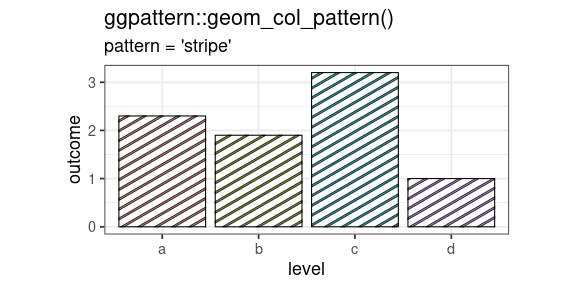

<!-- README.md is generated from README.Rmd. Please edit that file -->


# ggpattern 

<!-- badges: start -->
[](https://cran.r-project.org/package=ggpattern)

[](https://github.com/trevorld/ggpattern/actions)
<!-- badges: end -->

<span style="font-size: xx-large; font-weight: normal;">`ggpattern` provides custom `ggplot2` geoms which support filled areas with 
geometric and image-based patterns.</span>

Reading the articles/vignettes on [the package website](https://trevorldavis.com/R/ggpattern/dev/) is
probably the best way to get started.


## Feature Summary

* Custom versions of (almost) all the **geoms** from ggplot2 which have a region which can be filled.
* A suite of **aesthetics** for controlling the pattern appearance (e.g. `pattern_alpha`) 
* The ability to include **user-defined patterns** 


## Installation

You can install the development version from [R-universe](https://trevorld.r-universe.dev/ggpattern)

``` r
install.packages('ggpattern', repos = c('https://trevorld.r-universe.dev', 'https://cloud.r-project.org'))
```

or straight from the source hosted on Github using the `{remotes}` package:

``` r
# install.packages("remotes")
remotes::install_github("trevorld/ggpattern")
```

You can install the CRAN release version using:

```r
install.packages("ggpattern")
```

Do note though that due to CRAN size limitations **the CRAN version omits several vignettes** that are contained in the development version (as well as on the [package website](https://trevorldavis.com/R/ggpattern/)).

Depending on your operating system, which dependencies you have not previously installed, and the method you choose to install `{ggpattern}` it is possible that you may need to first install some system libraries manually using a tool like `apt`, `brew`, `dnf`, etc.  In particular as of June 2025 `{ggpattern}` depends on `{gridpattern}` which depends on `{sf}` which depends on `{s2}` and `{units}` which may need you to install the system development libraries for Abseil, OpenSSL, and `udunits2`.  If you pay close attention to any `install.packages()` error messages it will often tell you the name of the missing system library you need to install with `apt`, `brew`, `dnf`, etc.  Alternative R package installers like [`{pak}`](https://pak.r-lib.org/index.html) or [r2u](https://eddelbuettel.github.io/r2u/) may also be able to help install such system library dependencies if necessary.

An installation error is highly unlikely to be an issue with `{ggpattern}` itself.  Please don't open a Github issue unless you are **sure** it is an issue with `{ggpattern}` itself.  If you have an error installing the package we strongly suggest that you look at **all** your error messages more closely to figure out which package dependency is failing to install and why.  If necessary look up that package's documentation for additional information in installing it.  See https://thomasadventure.blog/posts/install-r-packages/ for more info on installing R packages.

## Quickstart

1. Take an existing plot which contains a geom with a fillable area e.g `geom_col()`.
2. Use the `{ggpattern}` version of the geom e.g. `ggpattern::geom_col_pattern()` instead of `ggplot2::geom_col()`
3. Set the aesthetic `pattern` to your choice of pattern e.g `pattern = 'stripe'`, 
   and set other options using `pattern_*` aesthetics


``` r
df <- data.frame(level = c("a", "b", "c", 'd'), outcome = c(2.3, 1.9, 3.2, 1))

ggplot(df) +
  geom_col_pattern(
    aes(level, outcome, pattern_fill = level), 
    pattern = 'stripe',
    fill    = 'white',
    colour  = 'black'
  ) +
  theme_bw(18) +
  theme(legend.position = 'none') + 
  labs(
    title    = "ggpattern::geom_col_pattern()",
    subtitle = "pattern = 'stripe'"
  ) +
  coord_fixed(ratio = 1/2)
```




# Gallery

<div>
<a href="https://trevorldavis.com/R/ggpattern/dev/articles/geom-gallery-array.html#geom-bar-pattern-"> </a>
<a href="https://trevorldavis.com/R/ggpattern/dev/articles/geom-gallery-geometry.html#b-w-example"> </a>
<a href="https://trevorldavis.com/R/ggpattern/dev/articles/geom-gallery-geometry.html#colour-example-1"> </a>
<a href="https://trevorldavis.com/R/ggpattern/dev/articles/geom-gallery-array.html#geom-bar-pattern-coord-flip-and-fit-image-to-height-and-graivty-towards-the-east-"> </a>
<a href="https://trevorldavis.com/R/ggpattern/dev/articles/geom-gallery-array.html#geom-density-pattern-"> </a>
<a href="https://trevorldavis.com/R/ggpattern/dev/articles/geom-gallery-geometry.html#geom-density-pattern-"> </a>
<a href="https://trevorldavis.com/R/ggpattern/dev/articles/geom-gallery-array.html#geom-map-pattern-"> </a>
<a href="https://trevorldavis.com/R/ggpattern/dev/articles/geom-gallery-array.html#geom-rect-pattern-"> </a>
<div>


# Feature Details


## Available Geoms

`ggpattern` includes versions of (nearly) all geoms from `ggplot2` which could plausibly
support being filled with a pattern.

See the vignette galleries for examples of all the available geoms filled with 
[geometry-based patterns](https://trevorldavis.com/R/ggpattern/dev/articles/geom-gallery-geometry.html) and 
[image-based/array-based patterns](https://trevorldavis.com/R/ggpattern/dev/articles/geom-gallery-array.html).


<details>
<summary> <span style="color: blue;"> Click to show/hide list of supported geoms </span> </summary>


| ggplot2        | ggpattern                     |
|----------------|-------------------------------|
| geom_area      | geom_area_pattern             |
| geom_bar       | geom_bar_pattern              |
| geom_bin2d     | geom_bin2d_pattern            |
| geom_boxplot   | geom_boxplot_pattern          |
| geom_col       | geom_col_pattern              |
| geom_crossbar  | geom_crossbar_pattern         |
| geom_density   | geom_density_pattern          |
| geom_histogram | geom_histogram_pattern        |
| geom_map       | geom_map_pattern              |
| geom_polygon   | geom_polygon_pattern          |
| geom_rect      | geom_rect_pattern             |
| geom_ribbon    | geom_ribbon_pattern           |
| geom_sf        | geom_sf_pattern               |
| geom_tile      | geom_tile_pattern             |
| geom_violin    | geom_violin_pattern           |

</details>

## New aesthetics

To control pattern appearance, a raft of new aesthetics have been added. e.g. 
`pattern_alpha`, `pattern_filename`, `pattern_density`.

There are also scale functions to control each of these new aesthetics e.g. 
`scale_pattern_alpha_discrete`.

Not all aesthetics apply to all patterns.  See the individual pattern vignettes
for which aesthetics it uses, or see the first vignette on developing user-defined
patterns for a [table of aesthetic use by pattern](https://trevorldavis.com/R/ggpattern/dev/articles/developing-patterns.html#aes-by-pattern),
or see the individual vignettes for each pattern.

<details>
<summary> <span style="color: blue;"> Click to show/hide list of new aesthetics </span> </summary>

| aesthetic                | description                                   | default    | possible values                    |
|--------------------------|-----------------------------------------------|------------|------------------------------------|
| `pattern`                  | Name of the pattern to draw                   | 'stripe'   | stripe, crosshatch, circle, image, placeholder, magick, gradient, plasma        |
| `pattern_type`             | Generic control option                        | NA         | pattern-dependent                  |
| `pattern_subtype`          | Generic control option                        | NA         | pattern-dependent                  |
| `pattern_alpha`            | Alpha                                         | 1          | value in range [0, 1] (npc units)  |
| `pattern_linetype`         | Stroke linetype                               | 1          | linetype                           |
| `pattern_size`             | Stroke linewidth                              | 1          | linewidth                          |
| `pattern_shape`            | Plotting shape                                | 1          | shapes                             |
| `pattern_colour`           | Stroke colour                                 | 'grey20'   | colour                             |
| `pattern_fill`             | Fill colour                                   | 'grey80'   | colour                             |
| `pattern_fill2`            | Second fill colour                            | '#4169E1'  | colour                             |
| `pattern_angle`            | Rotation angle                                | 30         | angle in degrees                   |
| `pattern_density`          | Approx. fraction of area the pattern fills    | 0.2        | value in range [0, 1] (fraction)   |
| `pattern_spacing`          | Spacing between repetitions of pattern        | 0.05       | value in range [0, 1] (npc units)  |
| `pattern_xoffset`          | Shift pattern along x axis                    | 0          | value in range [0, 1] (npc units)  |
| `pattern_yoffset`          | Shift pattern along y axis                    | 0          | value in range [0, 1] (npc units)  |
| `pattern_aspect_ratio`     | Aspect ratio adjustment                       | NA         | usual range [0.01, 10]             |
| `pattern_key_scale_factor` | Scale factor for pattern in legend            | 1          |                                    |
| `pattern_filename`         | Image filename/URL                            | ''         | Filename/URL                       |
| `pattern_gravity`          | Image placement                               | 'center'   | `ggpattern::magick_gravity_names`  |
| `pattern_filter`           | Image scaling filter                          | 'lanczos'  | `ggpattern::magick_filter_names`   |
| `pattern_scale`            | Scale                                         | 1          | Multiplier                         |
| `pattern_orientation`      | Orientation                                   | 'vertical' | 'vertical', 'horizontal', 'radial' |
| `pattern_phase`            | Phase                                         | 0          |                                    |
| `pattern_frequency`        | Frequency                                     | 0.1        |                                    |
| `pattern_option_1 - 5`     | Generic options for expansion                 | 0          |                                    |
| `pattern_grid`             | Grid type                                     | 'square'   | 'square', 'hex', 'hex\_circle'     |
| `pattern_res`              | Pattern resolution (pixels per inch)          | NA         | Resolution                         |
| `pattern_rot`              | Shape rotation angle (within pattern)         | 0          | angle in degrees                   |

</summary>
</details>

## User-Defined Patterns

Users can write their own pattern functions and ask `ggpattern` to use them, 
without having to include the pattern in the package.

See the vignette on developing patterns: [`vignette("developing-patterns", package = "ggpattern")`](https://trevorldavis.com/R/ggpattern/dev/articles/developing-patterns.html).

# Vignettes

**Note:** due to CRAN package size limits many of these vignettes are only available in the Github version of `{ggpattern}` and the package website.

#### General examples

* [Examples of every geom filled with the geometry-based patterns (i.e. 'stripe', 'crosshatch', 'circle')](https://trevorldavis.com/R/ggpattern/dev/articles/geom-gallery-geometry.html): `vignette("geom-gallery-geometry", package = "ggpattern")`
* [Examples of every geom filled with the array-based patterns (i.e. 'image', 'magick', 'gradient', 'plasma', 'placeholder')](https://trevorldavis.com/R/ggpattern/dev/articles/geom-gallery-array.html): `vignette("geom-gallery-geometry", package = "ggpattern")`

#### Exploration of pattern parameters and appearance

* [Patterns 'circle', 'pch', 'regular_polygon', 'rose' - Parameters and Examples](https://trevorldavis.com/R/ggpattern/dev/articles/patterns-points.html): `vignette("patterns-points", package = "ggpattern")`
* [Patterns 'gradient', 'ambient', 'plasma' - Parameters and Examples](https://trevorldavis.com/R/ggpattern/dev/articles/patterns-noise.html): `vignette("patterns-noise", package = "ggpattern")`
* [Patterns 'image' and 'placeholder' - Parameters and Examples](https://trevorldavis.com/R/ggpattern/dev/articles/patterns-image.html): `vignette("patterns-image", package = "ggpattern")`
* [Patterns 'magick' and 'polygon_tiling' - Parameters and Examples](https://trevorldavis.com/R/ggpattern/dev/articles/patterns-tilings.html): `vignette("patterns-tilings", package = "ggpattern")`
* [Patterns 'stripe', 'wave', 'crosshatch', 'weave' - Parameters and Examples](https://trevorldavis.com/R/ggpattern/dev/articles/patterns-stripes.html): `vignette("patterns-stripes", package = "ggpattern")`

* [Parameters for Geometry-based Patterns](https://trevorldavis.com/R/ggpattern/dev/articles/geometry-based-pattern-parameters.html): `vignette("geometry-based-pattern-parameters", package = "ggpattern")`

#### Developing your own pattern

* [Developing Patterns](https://trevorldavis.com/R/ggpattern/dev/articles/developing-patterns.html): `vignette("developing-patterns", package = "ggpattern")`

#### Other examples

* [Animating Patterns with `{gganimate}`](https://trevorldavis.com/R/ggpattern/dev/articles/gganimate.html): `vignette("gganimate", package = "ggpattern")`
* [Creating the Logo in R](https://trevorldavis.com/R/ggpattern/dev/articles/create-logo.html): `vignette("create-logo", package = "ggpattern")`

# Limitations

* Use `pattern_aspect_ratio` to override the internal aspect ratio calculation.
* Legend rendering for patterns is still not great.
    * Use `pattern_key_scale_factor` to adjust legend appearance.
* The Rstudio output device can be quite slow for plots with lots of patterns. It is
  often faster to save directly to PNG or PDF and view that.
* Self intersecting geometry can be an issue.  
* Non-linear coordinate systems have not been tested.
