``` r
suppressPackageStartupMessages({
  library("ggplot2")
  library("ggpattern")
  require("dplyr", quietly = TRUE)
  require("magick", quietly = TRUE)
  require("maps", quietly = TRUE)
  require("sf", quietly = TRUE)
})
```

## `geom_bar_pattern()`


``` r
if (require("magick")) {
p <- ggplot(mpg, aes(class)) +
  geom_bar_pattern(
    aes(
      pattern_fill = class
    ), 
    pattern         = 'plasma',
    colour          = 'black',
  ) +
  theme_bw(18) +
  labs(
    title = "ggpattern::geom_bar_pattern()",
    subtitle = "pattern = 'plasma'"
  ) + 
  theme(legend.position = 'none') +
  coord_fixed(ratio = 1/15) + 
  scale_pattern_discrete(guide = guide_legend(nrow = 1))

p
}
```

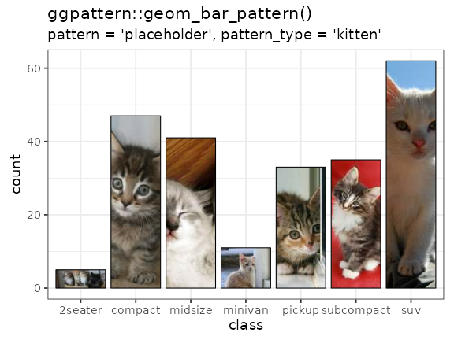

## `geom_bar_pattern()` - fit image to width and tile.


``` r
if (require("magick")) {

flags <- c(
  system.file("img", "flag", "au.png", package = "ggpattern"),
  system.file("img", "flag", "dk.png", package = "ggpattern"),
  system.file("img", "flag", "gb.png", package = "ggpattern"),
  system.file("img", "flag", "gr.png", package = "ggpattern"),
  system.file("img", "flag", "no.png", package = "ggpattern"),
  system.file("img", "flag", "se.png", package = "ggpattern"),
  system.file("img", "flag", "us.png", package = "ggpattern")
)

p <- ggplot(mpg, aes(class)) +
  geom_bar_pattern(
    aes(
      pattern_filename = class
    ), 
    pattern         = 'image',
    pattern_type    = 'tile',
    fill            = 'white', 
    colour          = 'black',
    pattern_filter  = 'box',
    pattern_scale   = -1
  ) +
  theme_bw(18) +
  labs(
    title = "ggpattern::geom_bar_pattern()",
    subtitle = "pattern = 'image'"
  ) + 
  theme(legend.position = 'none') +
  scale_pattern_filename_discrete(choices = flags) +
  coord_fixed(ratio = 1/15) + 
  scale_pattern_discrete(guide = guide_legend(nrow = 1))

p

}
```


## `geom_bar_pattern()` + `coord_flip` and fit image to height and graivty towards the east.


``` r
if (require("magick")) {

p <- ggplot(mpg, aes(class)) +
  geom_bar_pattern(
    aes(
      pattern_filename = class
    ), 
    pattern         = 'image',
    pattern_type    = 'none',
    fill            = 'grey80', 
    colour          = 'black',
    pattern_scale   = -2,
    pattern_filter  = 'point',
    pattern_gravity = 'east'
  ) +
  theme_bw(18) +
  labs(
    title = "ggpattern::geom_bar_pattern() + coord_flip()",
    subtitle = "pattern = 'image'"
  ) + 
  theme(legend.position = 'none') +
  scale_pattern_filename_discrete(choices = flags) +
  coord_flip() + 
  scale_pattern_discrete(guide = guide_legend(nrow = 1))

p

}
```

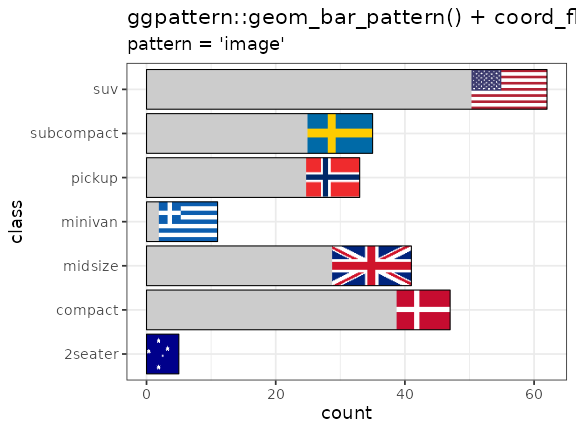

## pie graph with `geom_bar_pattern()`

* See `gridpattern::names_magick` for a list of all image based patterns from `imagemagick`


``` r
if (require("magick")) {

df <- data.frame(
  group = factor(c("Cool", "But", "Use", "Less"), levels = c("Cool", "But", "Use", "Less")),
  value = c(10, 20, 30, 40)
)

p <- ggplot(df, aes(x="", y = value, pattern_type = group, pattern_fill = group)) +
  geom_bar_pattern(
    pattern              = 'magick',
    width                = 1, 
    stat                 = "identity", 
    fill                 = 'white', 
    colour               = 'black',
    pattern_scale        = 3,
    pattern_aspect_ratio = 1,
    pattern_key_scale_factor = 1.5
  ) +
  coord_polar("y", start=0) + 
  theme_void(20) + 
  theme(
    legend.key.size = unit(2, 'cm')
  ) + 
  scale_pattern_type_manual(values = c(Cool = 'hexagons', But = 'crosshatch',
                                       Use = 'right45', Less = 'checkerboard')) + 
  labs(
    title = "ggpattern::geom_bar_pattern() + coord_polar()",
    subtitle = "pattern = 'magick'"
  )

p

}
```


## `geom_bin2d_pattern()`


``` r
if (require("magick")) {

p <- ggplot(diamonds, aes(x, y)) + 
  xlim(4, 10) + ylim(4, 10) +
  geom_bin2d_pattern(
    aes(pattern_type = after_stat(density)), 
    pattern       = 'magick',
    pattern_scale = 3,
    pattern_fill  = 'black',
    bins          = 6, 
    fill          = 'white', 
    colour        = 'black', 
    linewidth     = 0.5
  ) +
  theme_bw(18) +
  theme(legend.position = 'none') + 
  scale_pattern_type_continuous(choices = gridpattern::names_magick_intensity[15:21]) +
  labs(
    title = "ggpattern::geom_bin2d_pattern()",
    subtitle = "pattern = 'magick'"
  ) 

p

}
#> Warning: Removed 478 rows containing non-finite outside the scale range
#> (`stat_bin2d()`).
```

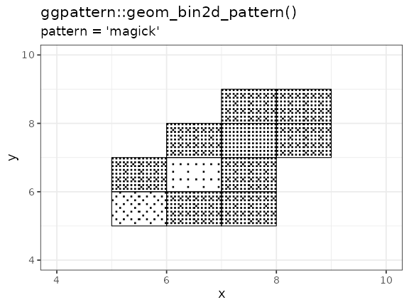
## `geom_boxplot_pattern()`


``` r
if (require("magick")) {

standard_image_filenames <- c(
  system.file('img', 'Rlogo.png'    , package = 'png'),
  system.file('img', 'bug.jpg'      , package = 'ggpattern'),
  system.file('img', 'magpie.jpg'   , package = 'ggpattern'),
  system.file('img', 'seamless1.jpg', package = 'ggpattern'),
  system.file('img', 'seamless2.jpg', package = 'ggpattern'),
  system.file('img', 'seamless3.jpg', package = 'ggpattern')
)

p <- ggplot(mpg, aes(class, hwy)) +
  geom_boxplot_pattern(
    aes(
      pattern_filename = class, 
    ), 
    pattern       = 'image',
    pattern_type  = 'tile',
    pattern_scale = 0.5
  ) +
  theme_bw(18) +
  labs(
    title = "ggpattern::geom_boxplot_pattern() + coord_flip()",
    subtitle = "pattern = 'image'"
  ) + 
  scale_pattern_filename_discrete(choices = standard_image_filenames) +
  theme(legend.position = 'none') + 
  coord_fixed(1/8)

p

}
```

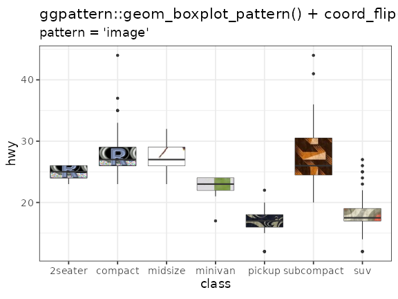

## `geom_col_pattern()`


``` r
if (require("magick")) {
df <- data.frame(trt = c("a", "b", "c"), outcome = c(2.3, 1.9, 3.2))

p <- ggplot(df, aes(trt, outcome)) +
  geom_col_pattern(
    pattern      = 'placeholder',
    pattern_type = 'bear',
    colour       = 'black'
  ) +
  theme_bw(18) +
  labs(
    title = "ggpattern::geom_col_pattern()",
    subtitle = "pattern = 'placeholder', pattern_type = 'bear'"
  ) + 
  theme(legend.position = 'none') +  
  coord_fixed(ratio = 1/2)

p
}
```

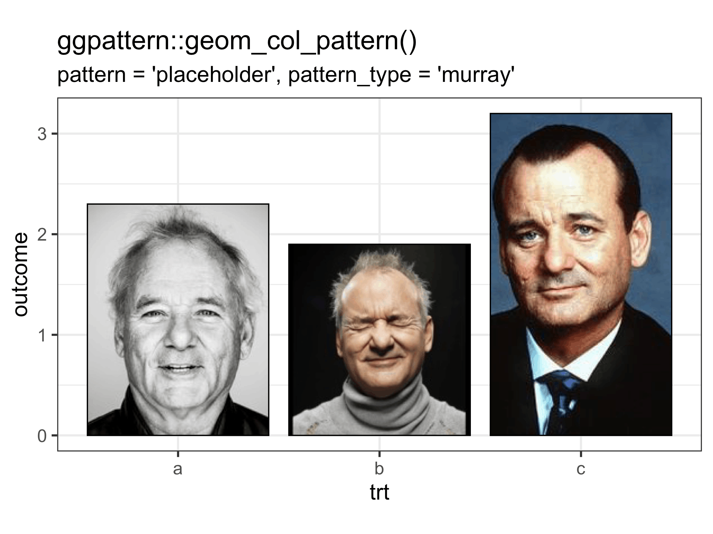

## `geom_crossbar_pattern()`


``` r
if (require("magick")) {

df <- data.frame(
  trt = factor(c(1, 1, 2, 2)),
  resp = c(1, 5, 3, 4),
  group = factor(c(1, 2, 1, 2)),
  upper = c(1.1, 5.3, 3.3, 4.2),
  lower = c(0.8, 4.6, 2.4, 3.6)
)

p <- ggplot(df, aes(trt, resp)) +
  geom_crossbar_pattern(
    aes(
      ymin          = lower, 
      ymax          = upper,
      pattern_fill  = interaction(trt, group),
    ), 
    pattern = 'plasma',
    width   = 0.2, 
  ) +
  theme_bw(18) +
  labs(
    title = "ggpattern::geom_crossbar_pattern()",
    subtitle = "pattern = 'plasma'"
  ) + 
  theme(legend.key.size = unit(1.5, 'cm')) +
  coord_fixed(ratio = 1/3)

p

}
```

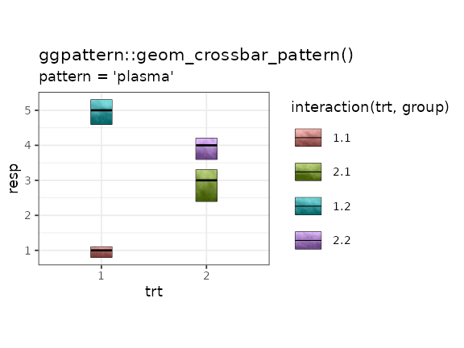

## `geom_density_pattern()`


``` r
if (require("magick")) {

seamless_image_filenames <- c(
  system.file('img', 'seamless1.jpg', package = 'ggpattern'),
  system.file('img', 'seamless2.jpg', package = 'ggpattern'),
  system.file('img', 'seamless3.jpg', package = 'ggpattern')
)

p <- ggplot(mtcars) +
  geom_density_pattern(
    aes(
      x                = mpg, 
      pattern_filename = as.factor(cyl)
    ), 
    pattern       = 'image',
    pattern_type  = 'tile'
  ) +
  theme_bw(18) +
  labs(
    title = "ggpattern::geom_density_pattern()",
    subtitle = "pattern = 'image'"
  ) + 
  scale_pattern_filename_discrete(choices = seamless_image_filenames) + 
  theme(legend.key.size = unit(2, 'cm')) +
  coord_fixed(ratio = 100)

p

}
```

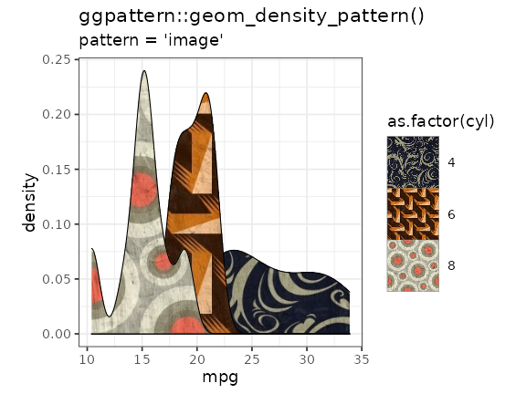

## `geom_map_pattern()`


``` r
if (require("magick") && require("maps")) {

crimes <- data.frame(state = tolower(rownames(USArrests)), USArrests)

states_map <- map_data("state")

p <- ggplot(crimes, aes(map_id = state)) +
    geom_map_pattern(
      map = states_map,
      aes(
        pattern_type = state
      ),
      pattern              = 'magick',
      pattern_fill         = 'black',
      pattern_aspect_ratio = 1.75,
      fill                 = 'white',
      colour               = 'black',
    ) +
    expand_limits(x = states_map$long, y = states_map$lat) +
    coord_map() +
    theme_bw(18) +
    labs(title = "ggpattern::geom_map_pattern()") + 
  labs(
    title = "ggpattern::geom_map_pattern()",
    subtitle = "pattern = 'magick'"
  ) + 
    scale_pattern_type_discrete(choices = gridpattern::names_magick) +
    theme(legend.position = 'none')

p

}
```

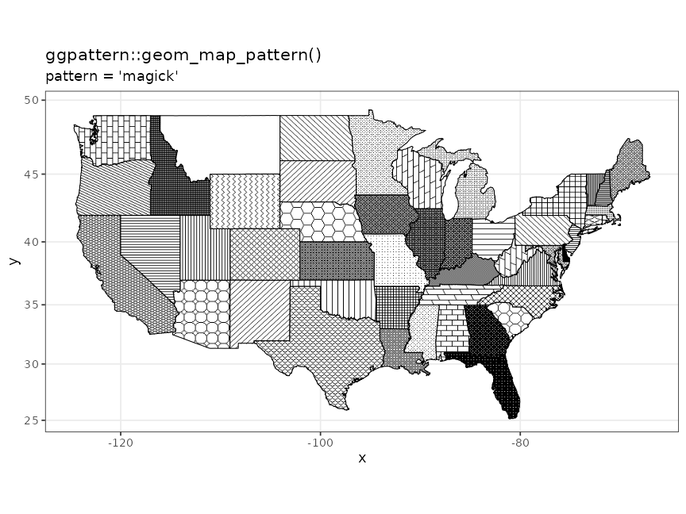

## `geom_polygon_pattern()`


``` r
if (require("magick")) {

angle <- seq(0, 2*pi, length.out = 7) + pi/6
polygon_df <- data.frame(
  angle = angle,
  x     = cos(angle),
  y     = sin(angle)
)

p <- ggplot(polygon_df) +
  geom_polygon_pattern(
    aes(x = x, y = y), 
    pattern          = 'image',
    pattern_filename = system.file('img', 'bug.jpg', package = 'ggpattern'),
    fill             = 'white', 
    colour           = 'black'
  ) + 
  labs(title = "ggpattern") + 
  coord_equal() + 
  theme_bw(25) + 
  theme(axis.title = element_blank())

p

}
```

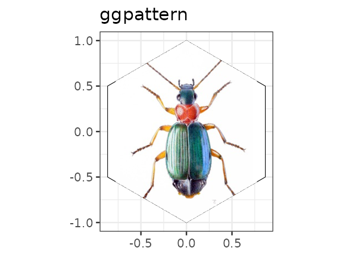

## `geom_rect_pattern()`


``` r
if (require("magick")) {

plot_df <- data.frame(
  xmin    = c(0, 10, 3),
  xmax    = c(8, 18, 4),
  ymin    = c(0, 10, 8),
  ymax    = c(5, 19, 15),
  type    = c('a', 'b', 'c'),
  colour1 = c('red', 'black', 'blue'),
  colour2 = c('black', NA, 'yellow'),
  orient  = c('horizontal', 'radial', 'vertical'),
  stringsAsFactors = FALSE
)

p <- ggplot(plot_df) +
  geom_rect_pattern(
    aes(
      xmin=xmin, ymin=ymin, xmax=xmax, ymax=ymax,
      pattern_fill  = I(colour1),
      pattern_fill2 = I(colour2),
      pattern_orientation = I(orient)
    ),
    pattern         = 'gradient',
    colour          = 'black',
    pattern_density = 0.3,
    fill = NA
  ) +
  theme_bw(18) +
  labs(
    title = "ggpattern::geom_rect_pattern()",
    subtitle = "pattern = 'gradient'"
  ) + 
  theme(legend.key.size = unit(1.5, 'cm'))

p

}
```

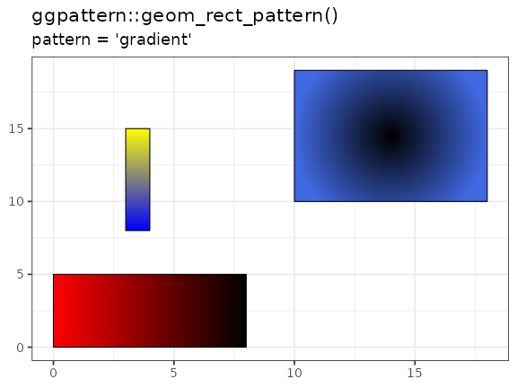

## `geom_ribbon_pattern()`


``` r
if (require("magick")) {

huron <- data.frame(year = 1875:1972, level = as.vector(LakeHuron))

p <- ggplot(huron, aes(year)) +
  geom_ribbon_pattern(
    aes(
      ymin = level - 1, 
      ymax = level + 1
    ), 
    fill            = NA, 
    colour          = 'black',
    pattern         = 'image',
    pattern_type    = 'tile',
    pattern_filename = system.file('img', 'seamless2.jpg', package = 'ggpattern'),
    outline.type    = 'full'
  ) +
  theme_bw(18) +
  labs(
    title = "ggpattern::geom_ribbon_pattern()",
    subtitle = "pattern = 'image'"
  ) 

p

}
```

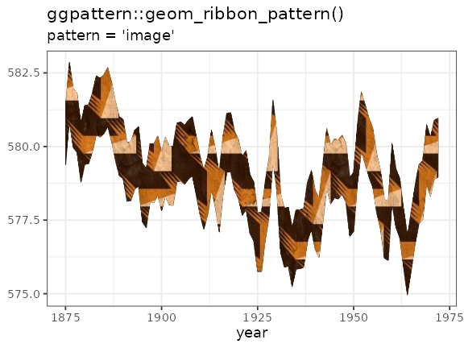

## `geom_sf_pattern()`


``` r
if (require("dplyr") && require("magick") && require("sf")) {

nc <- sf::st_read(system.file("shape/nc.shp", package = "sf"), quiet = TRUE)
nc <- nc %>% filter(between(CNTY_ID, 1820, 1830))


p <- ggplot(nc) +
  geom_sf_pattern(
    aes(
      fill    = NAME,
    pattern_type = NAME
    ),
    pattern = 'placeholder',
    pattern_type = 'keanu',
    pattern_aspect_ratio = 3
  ) +
  theme_bw(15) + 
  theme(legend.position = 'none') +
  labs(
    title = "ggpattern::geom_sf_pattern()",
    subtitle = "pattern = 'placeholder', pattern_type = 'keanu'"
  ) 

p

}
```

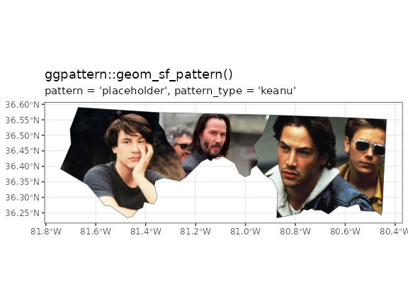

## `geom_tile_pattern()`


``` r
if (require("magick")) {

df <- data.frame(
  x = rep(c(2, 5, 7, 9, 12), 2),
  y = rep(c(1, 2), each = 5),
  z = factor(rep(1:5, each = 2)),
  gravity = rep(c('north', 'south'), 5),
  type    = c('expand', 'fit', 'squish', 'tile', 'expand', 'fit', 'squish', 'tile', 'squish', 'squish'),
  w = rep(diff(c(0, 4, 6, 8, 10, 14)), 2)
)

p <- ggplot(df, aes(x, y)) +
  geom_tile_pattern(
    aes(
      fill    = z, 
      pattern_filename = z,
      pattern_gravity  = I(gravity),
      pattern_type     = I(type)
    ), 
    pattern = 'image',
    colour = "grey50"
  ) +
  theme_bw(18) +
  labs(
    title = "ggpattern::geom_tile_pattern()",
    subtitle = "pattern = 'image'"
  ) + 
  scale_pattern_filename_discrete(choices = standard_image_filenames) + 
  theme(
    legend.position = 'bottom',
    legend.key.size = unit(1.5, 'cm')
  ) + 
  coord_fixed(ratio = 4)

p

}
```

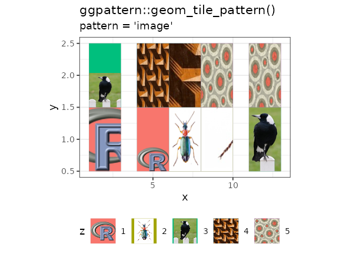

## `geom_violin_pattern()`


``` r
if (require("magick")) {

p <- ggplot(mtcars, aes(as.factor(cyl), mpg)) +
  geom_violin_pattern(
    aes(pattern_filename = as.factor(cyl)),
    pattern = 'image',
    pattern_type = 'tile'
  ) +
  theme_bw(18) +
  labs(
    title = "ggpattern::geom_violin_pattern()",
    subtitle = "pattern = 'image'"
  ) + 
  theme(
    legend.key.size  = unit(2, 'cm')
  ) + 
  scale_pattern_filename_discrete(choices = seamless_image_filenames) +
  coord_fixed(1/15)

p

}
```

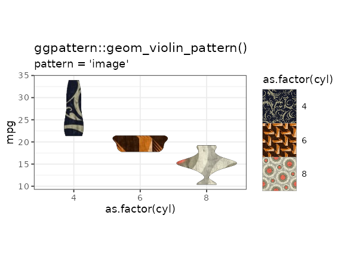
